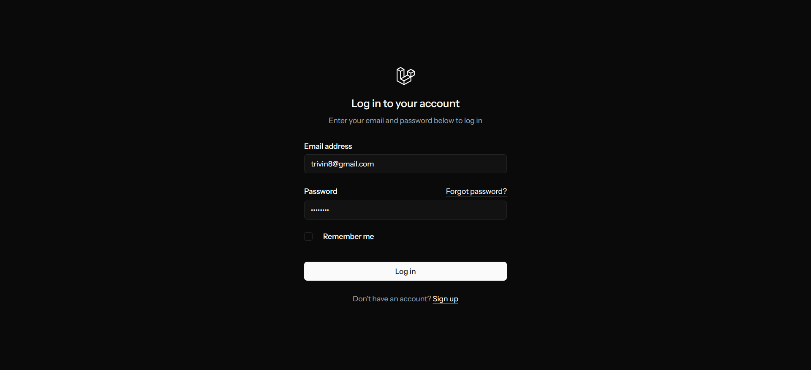

# Oyes Booking Appointment System
<hr><p>Book Appointment and sync with google calendar also send notification emails to attendees</p><h2>Technologies Used</h2>
<hr><ul>
<li>laravel</li>
</ul><ul>
<li>vue js</li>
</ul><ul>
<li>Google oAuth</li>
</ul><ul>
<li>Google Calendar</li>
</ul><h2>Features</h2>
<hr><ul>
<li>Appointment Booking form</li>
</ul><ul>
<li>Appointment Slot Checker with current time and availability</li>
</ul><ul>
<li>Google Api Integration</li>
</ul><ul>
<li>Email Notification</li>
</ul><ul>
<li>Admin Page</li>
</ul><ul>
<li>Validation</li>


### Screenshots
<div align="center"> 
  
  
  
  
  
  
</div>
<hr>

### Install Prerequisites
<p>PHP (8.2 or higher)</p>
<p>Composer (Dependency Manager)</p>
<p>Node.js & npm (for frontend assets)</p>
<p>MySQL or another database system</p>
<p>Git (for cloning the repository)</p>


### Check PHP & Composer

```
    php -v  
    composer -v  
    node -v  
    npm -v  
```

<hr>

### Steps
<ul><li>Git Clone project</li></ul>
<ul><li>cd project</li></ul>
<ul><li>composer i</li></ul>
<ul><li>npm i</li></ul>
<ul><li>copy .env.example and save it as .env</li></ul>
<ul><li>php artisan migrate</li></ul>
<ul><li>composer run dev</li></ul>


### Environment Variables

To run this project, you will need to add the following environment variables to your .env file

```bash

APP_URL=http://127.0.0.1:8000

#--------------------------------------------------------------------
# DATABASE
#--------------------------------------------------------------------
 DB_CONNECTION=sqlite
# DB_HOST=127.0.0.1
# DB_PORT=3306
# DB_DATABASE=laravel
# DB_USERNAME=root
# DB_PASSWORD=
 
# Looking to send emails in production? Check out our Email API/SMTP product!  
#YOUR Mailtrap Keys for testing email 
MAIL_MAILER=smtp
MAIL_HOST=sandbox.smtp.mailtrap.io
MAIL_PORT=2525
MAIL_USERNAME=3965efc125f
MAIL_PASSWORD=1c46e23f33
MAIL_FROM_ADDRESS="info@trovolink.com"
MAIL_FROM_NAME="${APP_NAME}"


SESSION_DRIVER=file
SESSION_LIFETIME=120
SESSION_ENCRYPT=false
SESSION_PATH=/
SESSION_DOMAIN=127.0.0.1
 
 
#--------------------------------------------------------------------
# Google Api
#--------------------------------------------------------------------
#YOUR Google Client  KEYS

GOOGLE_CLIENT_ID=xxxx...xxxx...xxxx...xxx..xxxx
GOOGLE_CLIENT_SECRET=xxxx...xxxx...xxxx...xxx..xxxx
GOOGLE_REDIRECT_URI=http://127.0.0.1:8000/auth/google/callback
 
```

<!-- Run Locally -->

### Run Locally

Go to the project directory

```
  cd my-project
```

run

```
  composer i
```
```
  npm i
```
```
  php artisan migrate
```

Start the server

```
  composer run dev
```

Run queue Woker server

```
 php artisan queue:work
```

<!-- Usage -->

## Usage

```dash
http://127.0.0.1:8000/
http://127.0.0.1:8000/register
http://localhost:8081/login

http://localhost:8081/admin
```

## Contact

<hr><p><span style="margin-right: 30px;"></span><a href="https://www.linkedin.com/in/0y3"></a><span style="margin-right: 30px;"></span><a href="https://github.com/0y3"></a></p>